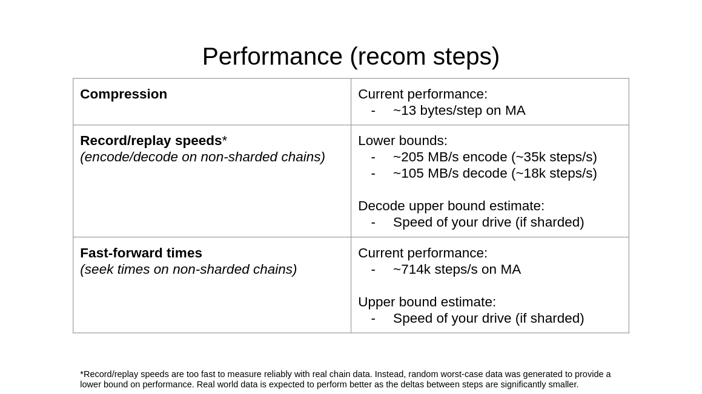

## pcompress
Currently it is hard to store the state of every single step of a Markov Chain Monte Carlo run from [GerryChain Python](https://github.com/mggg/GerryChain) or [GerryChain Julia](https://github.com/mggg/GerryChainJulia).
This repo aims to produce an efficient intermediate binary representation of partitions/districting assignments that will enable generated plans to be saved on-the-fly.
Each step is represented as the diff from the previous step, enabling a significant reduction in disk usage per step.
The intermediate representation is then compressed with LZMA2 (via XZ).

With pcompress, you can save/replay MCMC runs in a portable format, enabling our current use cases such as:
- proactively running MCMC on various states, then replaying at much higher speeds (e.g. 10-30x in PA at the congressional level) for quick analysis turnaround time
- taking advantage of the speed of GerryChain Julia (or [frcw.rs](https://github.com/pjrule/frcw.rs)) while using the rich analysis tooling in GerryChain Python
- comparing the various MCMC implementations (Julia, Rust, and Python) using pcompress's interoperability features
- saving MCMC runs for easy, exact reproducibility of experiments
- etc.

`pcompress` is currently used within MGGG to power nearly all of our MCMC/ensemble analysis in order to provide quick analysis turnaround times and ensure reproducibility.

## Performance
These stats are from the initial annoucement of `pcompress` at lab meeting.
Note that these metrics may be slightly outdated -- you may see better real-world performance.
Additionally, these metrics do not take into account updaters/scoring overhead (as this is dependent on the user's code).



The upper bounds given are intended to give an estimate of how fast `pcompress` could go, if we optimized further and implemented sharding.

## Installation
```bash
cargo install pcompress
pip install pcompress
```

## Python Usage (with GerryChain)
Note that `chain` is a normal MarkovChain object and `graph` is a normal GerryChain graph.

#### Recording

```python
from pcompress import Record

for partition in Record(chain, "pa-run.chain"):
    # normal chain stuff here
```

#### Replaying

```python
from pcompress import Record

for partition in Replay(graph, "pa-run.chain", updaters=my_updaters):
   # normal chain stuff here
```

For more examples with GerryChain Python, [look here](https://github.com/InnovativeInventor/pcompress/blob/main/python/demo/pcompress-demo.ipynb).

## License and Credit
`pcompress` is written and maintained by [Max Fan](https://max.fan) and is licensed under the [AGPLv3 license](LICENSE).
If you want to contribute, PRs are always welcome.
